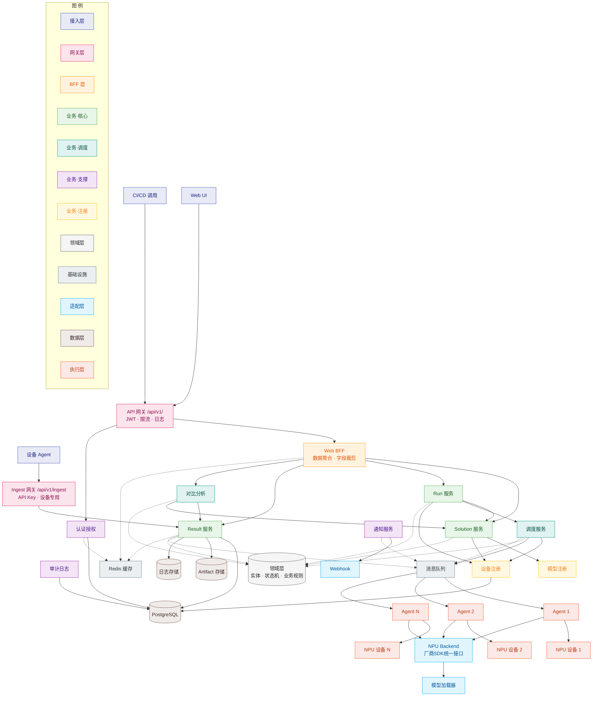

# NPU 模型推理基准测试平台 软件工程设计报告

文档版本：V1.0　　编制日期：2026-05-15　　适用阶段：概要设计 + 详细设计

---

## 1. 文档概述

### 1.1 文档目的

本文档是 **NPU 模型推理基准测试平台** 的完整软件工程设计说明书，用于明确系统整体架构、功能模块、接口规范、数据模型、调度流程、安全权限、部署运维等关键设计内容，指导平台开发、测试、部署与迭代，确保平台实现**标准化记录、横向对比、历史复用**三大核心价值，为跨硬件、跨模型、跨场景的推理性能评测提供统一、可信、可复现的基准能力。

### 1.2 文档范围

本文档定义 NPU 推理性能基准测试平台的整体设计方案，覆盖系统从任务提交到结果分析的完整链路，属于系统级设计文档（Architecture Level Design）。

（1）覆盖范围（In Scope）

本平台设计涵盖以下核心模块：

后端服务：任务管理、调度控制、数据处理等核心逻辑
前端页面：任务提交、性能展示与对比分析界面
设备端 Agent：运行在测试设备上的执行代理，负责任务拉取与执行
NPU 硬件适配层：对接不同厂商 NPU SDK，实现统一调用接口
任务调度系统：支持多设备任务分发与执行控制
数据存储系统：测试结果、日志与元数据的统一存储与管理
接口设计：系统内部与外部 API 定义
安全与鉴权：用户访问控制与接口安全机制
可观测性：日志、监控与性能指标采集
部署与运维：系统部署方案与运行维护机制

本系统边界限定于推理性能测试与数据管理平台本身，不涉及模型开发与底层硬件实现。

（2）不包含范围（Out of Scope）

为明确系统职责边界，以下内容不在本平台设计范围内：

模型训练流程及训练性能优化
算子级精度对齐与数值验证
厂商 NPU SDK 的二次开发与底层实现
通用 AI 训练/推理框架的开发（如深度学习框架本身）
训练性能评测体系

上述能力依赖外部系统或厂商工具，本平台仅负责调用与集成其推理能力。

### 1.3 术语与缩写

| 术语 | 全称 / 含义 |
|------|------------|
| Solution | 可复现的唯一推理测试配置（模型 × 硬件 × 精度 × 编译参数）|
| Benchmark Run | 一次基准测试执行任务 |
| Benchmark Result | 单次任务产出的性能指标结果 |
| NPU Backend | NPU 厂商 SDK 适配层，屏蔽硬件差异 |
| TTFT | Time To First Token，大模型首 Token 延迟 |
| TPS | Tokens Per Second，大模型生成吞吐量 |
| CV | Coefficient of Variation，变异系数，判断数据稳定性 |
| Ingest | 设备端测试结果批量上报接口 |
| QPS | Queries Per Second，推理吞吐量 |
| Task | 用户提交的测试任务，通常对应一个或多个 Benchmark Run |
| Model | 被测试的推理模型（如 ResNet、LLM 等） |
| Device | 执行测试的硬件设备（如具体型号 NPU） |
---

## 2. 项目背景与设计目标

### 2.1 业务背景

当前 NPU 推理性能测试主要由算法工程师与硬件验证团队分别执行，在多型号硬件与多模型场景下，逐渐暴露出以下问题：

1. **数据管理问题**：性能数据分散存储于各类测试脚本与文档中，缺乏统一的数据格式与记录规范，导致数据难以集中管理与统一分析。
2. **测试流程问题**：跨硬件、跨团队的性能对比依赖人工整理与统计，不仅效率低下（单次对比耗时较长），且容易出现数据错误，缺乏可追溯性。
3. **数据复用问题**：历史测试数据缺乏结构化沉淀与统一存储，难以复用，导致重复测试频繁发生，造成人力与计算资源浪费。
4. **决策支撑不足**：缺乏标准化、可复现的性能基准体系，难以为硬件选型与性能优化提供可靠依据。

因此，有必要建设统一的 NPU 推理性能基准测试平台，实现测试流程标准化、性能数据集中管理以及自动化对比分析能力，从而提升测试效率与决策科学性。

### 2.2 核心目标

| 核心价值 | 具体说明 |
|---------|---------|
| **标准化记录** | 建立统一的推理性能测试规范，包括计时边界、预热策略与指标定义；所有测试数据结构化入库，支持结果可追溯与复现，确保同一 Solution 在不同时间与环境下结果一致性 |
| **横向对比能力** | 提供多维度性能对比能力（模型 / 硬件 / 精度 / 场景），支持实时查询与排序分析；单次查询响应时间 ≤ 2s，支持至少 10 万级历史记录对比 |
| **历史复用机制** | 自动识别相同方案的历史测试结果，避免重复执行；支持版本、时间维度的性能趋势分析，可减少≥50% 重复测试任务，提升测试效率 |
| **工程化与平台能力** | 搭建高可用性能测试平台，核心服务可用性≥99.9%；支持多设备弹性扩展与≥100 并发任务调度，具备完整日志、监控、告警体系，满足企业级部署与运维规范 |

### 2.3 非目标

- 不覆盖 NPU 训练性能评测（本平台仅关注推理性能评估）
- 不替代厂商 SDK 自带 profiling / trace 工具（底层性能分析依赖厂商能力）
- 不做跨 NPU 算子级精度对齐（精度验证属于模型与框架层问题）
- 不提供模型训练与编译服务，仅复用编译产物（本平台仅负责推理执行与性能评估）

---

## 3. 需求分析

### 3.1 功能需求

1. **Solution 配置管理**：用于定义可复现的测试配置，支持：

- 配置创建、编辑、删除与查询（CRUD）
- 状态流转（draft / published / archived）
- 配置克隆（用于快速复用）
- 发布锁定（保证线上测试配置不可变）
2. **测试任务调度**：负责测试任务的全生命周期管理，包括：

- 任务创建（基于 Solution）
- 多设备任务分发与调度
- 执行状态追踪（pending / running / completed / failed）
- 超时控制与自动重试机制
- 幂等控制，避免重复执行
3. **指标采集**：统一采集与计算推理性能指标，包括：

- 延迟指标：P50 / P95 / P99
- 吞吐指标：QPS / TPS
- 大模型指标：TTFT
- 资源指标：内存峰值、功耗
- 稳定性指标：CV（变异系数）
- 可靠性指标（建议新增）：成功率、错误率
4. **结果管理**：实现测试结果的标准化管理与分析：

- 数据自动校验（异常值检测）
- 结果结构化入库
- 日志统一存储与关联
- 历史数据查询与筛选
5. **对比分析**：提供多维度性能分析能力：

- 差值分析（Delta）
- 排名与排序
- 雷达图等可视化分析
- 快照保存与结果分享
6. **模型 / 设备注册**：统一管理测试资源：

- 模型元数据管理（模型版本、输入规格等）
- NPU 设备注册与状态管理
7. **权限安全**：保障系统访问与数据安全：

- 用户认证（JWT）
- RBAC 角色权限控制
- API Key 管理与轮换
- 分享链接权限控制
8. **Agent 协同**：实现分布式测试执行能力：

- 任务拉取（Polling / Push）
- 心跳检测与设备状态监控
- 任务执行与结果自动上报
- 失败重试与断点恢复
- 幂等处理与重复任务防护

**性能指标说明：**

| 编号 | 指标 | 说明 |
|------|------|------|
| 1 | P50 | 50% 请求延迟低于该值 |
| 2 | P95 | 95% 请求延迟低于该值 |
| 3 | P99 | 99% 请求延迟低于该值 |
| 4 | TTFT | 首 token 生成时间 |
| 5 | TPS | 每秒生成 token 数 |
| 6 | CV | 变异系数，用于判断测试数据稳定性 |

### 3.2 非功能需求

| 类别 | 要求 |
|------|------|
| 性能 | API 接口响应时间 < 300ms；页面加载时间 < 1s；支持 ≥100 台设备并发执行任务 |
| 可用性 | 系统整体可用性 ≥ 99.5%；任务执行具备幂等性，保证不丢失、不重复执行 |
| 数据可信 | 当 CV > 5% 自动标记为 unstable；每个测试至少执行 3 次并取中位数作为最终结果 |
| 安全性 | 基于 JWT 的用户认证；API Key 支持轮换；接口限流与防刷；敏感信息不在前端暴露 |
| 扩展性 | 支持新 NPU 硬件快速接入（插件化 Backend）；模型类型可扩展 |
| 可观测性 | 覆盖日志（Logging）、指标（Metrics）、链路追踪（Tracing）与告警（Alerting） |

---

## 4. 总体架构设计

### 4.1 技术栈

| 层 | 技术选型 | 选型说明 |
|----|---------|---------|
| 后端框架 | Python 3.11 + FastAPI 0.115 | 支持异步高并发，开发效率高，适合任务调度与 IO 密集型场景 |
| ORM / 迁移 | SQLAlchemy 2.0（async）+ Alembic | 支持异步 ORM 与数据库版本管理，便于 schema 演进 |
| 数据库 | PostgreSQL 16（asyncpg 驱动）| 支持复杂查询与分析（JSON / 聚合），适合性能数据存储 |
| 前端框架 | Next.js 16（App Router）+ TypeScript + Tailwind CSS  | 支持 SSR/CSR 混合渲染，提升性能与开发体验 |
| 图表 | 纯 SVG 自绘，无第三方依赖 | 减少第三方依赖，提高可控性与定制能力 |
| 测试 | pytest-asyncio、Vitest | 覆盖后端异步逻辑与前端组件测试 |
| 部署 | Docker Compose / Kubernetes | 支持从单机部署到集群扩展 |

### 4.2 系统分层架构

| 分层 | 核心职责说明 | 平台业务落地内容 |
| ---- | ---- | ---- |
| 接入层 | 系统对外统一接入入口 | Web UI、设备Agent、CI调用、服务健康探测 |
| 网关层 | API流量统一管控与路由 | 统一接口前缀`/api/v1`、鉴权、限流、请求路由、全局日志采集 |
| BFF适配层（新增） | Web端专用数据聚合转换 | 前端接口聚合、多源数据组装、报表字段裁剪、P50/P95/P99图表数据封装 |
| 基础设施Infra层（新增） | 中间件与公共能力底座 | MQ消息队列、Redis缓存、链路追踪、监控SDK、项目公共工具 |
| 业务应用层 | 核心业务流程编排 | 测试任务调度、性能跑分计算、Solution方案管理、测试结果分析对比 |
| 领域层 | 业务实体与领域规则封装 | 领域实体：Solution/Run/Result/Comparison；封装任务状态、跑分核算等核心业务规则 |
| 外部适配层 | 对接异构外部系统 | NPU后端硬件适配、模型加载器、Webhook回调、OSS模型/测试产物存储对接 |
| 数据层 | 结构化数据落地持久化 | PostgreSQL，存储方案配置、任务记录、性能指标等结构化数据 |
| 执行层 | 底层硬件算力执行 | NPU硬件+底层驱动，仅负责模型实际推理运算 |
### 4.3 核心数据流


系统核心数据流如下：

用户在 Web UI 创建 Solution 配置，并提交测试请求
后端生成 Benchmark Run 任务，并写入任务队列
设备 Agent 通过轮询或推送机制获取待执行任务
Agent 加载模型与 NPU Backend，完成推理环境初始化
执行预热（Warmup）与正式采样（Sampling）
计算性能指标（P50/P95/P99、TPS、TTFT 等）
将结果与日志通过 Ingest 接口上报后端
后端进行数据校验（异常检测、CV 计算）并入库
分析模块对结果进行对比计算（Delta、排名等）
前端进行可视化展示，并支持结果分享
### 4.4 系统架构图



| 分层 (颜色) | 节点 | 核心职责 |
|-------------|------|---------|
| 接入层 (蓝) | Web UI · Agent · CI | 三类用户入口 |
| 网关层 (粉) | API 网关 · Ingest 网关 | 双通道鉴权分流：JWT（人） / API Key（设备） |
| BFF 层 (橙) | Web BFF | 前端专用聚合，一次返回页面所需全量数据 |
| 业务·核心 (绿) | Solution · Run · Result | 配置管理 · 任务生命周期 · 指标校验入库 |
| 业务·调度 (青) | Scheduler · Compare | 设备匹配分发 · 多维度对比分析 |
| 业务·支撑 (紫) | Auth · Audit · Notify | 认证授权 · 操作审计 · 状态通知 |
| 业务·注册 (黄) | ModelReg · DeviceReg | 模型/设备元数据统一管理 |
| 领域层 (灰) | 实体 · 状态机 · 规则 | CV 稳定性 / 中位数聚合 / 幂等去重 集中封装 |
| 基础设施 (蓝灰) | MQ · Cache | 异步解耦 · 热点缓存 |
| 适配层 (浅蓝) | Backend · Loader · Webhook | 厂商 SDK 统一接口 · 模型加载 · 外部回调 |
| 数据层 (棕) | PostgreSQL · Artifact · 日志 | 结构化存储 · 编译产物 · 全量日志 |
| 执行层 (红) | Agent · NPU 设备 | 物理执行：拉取任务 → 推理 → 上报 |

**核心数据流：**
```
用户提交 → WebBFF → RunSvc → Scheduler → MQ → Agent → NPU → IngestGW → ResultSvc → DB  ─┐
                                                                                         ↓
                                                                              NotifySvc → Webhook
```

---


## 5. 详细设计

### 5.1 核心实体设计

#### 5.1.1 Solution（核心配置）

```
Solution = model_id × device_id × ConversionConfig × RuntimeConfig
```

**关键字段：**

| 字段 | 说明 |
|------|------|
| `model_id` | 模型标识 |
| `device_id` | 设备标识 |
| `conversion_config` | 编译参数（精度、优化选项等）|
| `runtime_config` | 运行参数（batch size、并发数等）|
| `input_config` | 输入规格（分辨率 / 序列长度等）|

**唯一性约束：** `(model_id, device_id, conversion_config, runtime_config, input_config)` 组合唯一。

**状态机：** `draft → published → archived`

**约束：**

| 规则 | 说明 |
|------|------|
| 不可变 | `published` 状态后配置不可修改 |
| 克隆 | 支持 Clone 生成新 draft Solution |
| 批量对比 | 支持多 Solution 同时加入 Comparison |

#### 5.1.2 Benchmark Run（执行任务）

**状态机：** `pending → running → completed / failed`

**触发方式：**

| 方式 | 说明 |
|------|------|
| `manual` | 用户手动触发 |
| `auto` | CI / API 触发 |
| `scheduled` | 定时任务触发 |

**关键机制：**

| 机制 | 说明 |
|------|------|
| 超时控制 | 默认 30 分钟，超时自动标记失败 |
| 自动重试 | 最多 N 次（可配置）|
| 幂等性 | 同一 `run_id` 不可重复执行 |
| 设备亲和性 | 支持将任务调度到指定设备 |

#### 5.1.3 Benchmark Result（测试结果）

**指标分类：**

| 类别 | 指标字段 | 说明 |
|------|---------|------|
| 延迟 | `p50_ms` / `p95_ms` / `p99_ms` | 推理延迟百分位值 |
| 吞吐 | `qps` / `tps` | 每秒请求数 / 每秒 token 数 |
| 资源 | `memory_peak_mb` / `power_mw` | 内存峰值 / 平均功耗 |
| LLM 专属 | `ttft_ms` | 首 token 生成时间 |
| 精度 | `top1` / `top5` / `mAP50` | 按任务类型（分类 / 检测）|
| 稳定性 | `cv` | 变异系数，CV > 5% 标记 unstable |
| 环境快照 | `sdk_version` / `driver_version` / `os_version` | 执行环境版本信息 |

**统计规则：** 每组配置至少执行 3 次，取中位数作为最终入库值。

#### 5.1.4 Comparison（对比）

**功能：**

| 功能 | 说明 |
|------|------|
| 对比规模 | 支持 2–8 个 Solution 同时对比 |
| Delta 分析 | 自动计算各指标相对 baseline 的差值与百分比 |
| 排名 | 按各指标对参与 Solution 排序 |
| 雷达图 | 各指标归一化后可视化展示 |
| 分享 | 支持生成分享链接，可设置过期时间与访问权限 |

### 5.2 接口层设计

#### 5.2.1 NPU Backend 适配器

每款硬件对应一个 Backend 实现，统一接口：

```python
class NPUBackend:
    def load(self, model_path: str, precision: str) -> None: ...
    def warmup(self, inputs: dict, n: int) -> None: ...
    def run(self, inputs: dict) -> dict: ...
    # 返回结构：{"outputs": {...}, "memory_peak_mb": float | None}
    def cleanup(self) -> None: ...
```

已规划适配器：

| Backend 类 | 适用硬件 | 底层 SDK |
|------------|----------|---------|
| `OnnxRuntimeNPUBackend` | 通用 | ONNX Runtime EP |
| `VendorXBackend` | H1 | Vendor X SDK |
| `VendorYBackend` | H2 | Vendor Y SDK |

> 计时统一包裹 `run()` 调用，不下沉到 Backend，保证测量口径一致。

#### 5.2.2 模型加载器

负责模型文件管理与加载。

**功能：**

- 根据 `model_id` 获取模型路径
- 支持多格式（ONNX / TensorRT / PyTorch）

**缓存机制：**

- 缓存键：`(solution_id, sdk_version)`
- 命中缓存 → 直接加载编译产物
- 未命中 → 执行编译并缓存
- SDK 升级 → 自动失效并重新编译

**存储：** 编译产物存储在 Artifact 存储系统中

#### 5.2.3 通知器

用于在任务状态变更时向外部系统发送通知（如任务完成 / 失败）。

##### 功能

- 在 Benchmark Run 完成或失败时触发通知
- 支持异步推送，避免阻塞主流程
- 支持多种通知渠道扩展（Webhook、企业IM、邮件等）

##### 接口定义

统一定义通知接口：

```python
class Notifier:
    def send(self, event: dict) -> None:
        """
        发送通知事件
        event 示例：
        {
            "run_id": str,
            "status": "completed" | "failed",
            "solution_id": str,
            "metrics": {...},
            "timestamp": int
        }
        """
```

### 5.3 API 路由设计

后端 API 统一前缀 `/api/v1/`，RESTful 风格。

#### Solutions

| 方法 | 路径 | 说明 |
|------|------|------|
| GET | `/api/v1/solutions` | 获取 Solution 列表（支持分页、过滤、搜索、排序） |
| POST | `/api/v1/solutions` | 创建 Solution |
| GET | `/api/v1/solutions/{id}` | 获取单个 Solution |
| PATCH | `/api/v1/solutions/{id}` | 更新 Solution（archived 状态不可修改） |
| DELETE | `/api/v1/solutions/{id}` | 软删除（状态置为 archived） |
| POST | `/api/v1/solutions/{id}/publish` | 发布 Solution（draft → published） |
| POST | `/api/v1/solutions/{id}/clone` | 克隆为新 Solution（状态为 draft） |

> **说明：** Solution 作为核心资源，遵循 RESTful 资源设计；`publish` / `clone` 属于状态变更或派生操作，采用子路径表示；`archived` 状态为终态，不允许修改或再次发布。

#### Benchmark Runs

| 方法 | 路径 | 说明 |
|------|------|------|
| POST | `/api/v1/solutions/{id}/runs` | 基于 Solution 创建测试任务 |
| GET | `/api/v1/solutions/{id}/runs` | 查询该 Solution 的任务列表（支持分页/过滤） |
| GET | `/api/v1/runs/{run_id}` | 获取单个任务详情 |
| PATCH | `/api/v1/runs/{run_id}` | 更新任务状态（pending → running → completed / failed） |

#### Benchmark Results

| 方法 | 路径 | 说明 |
|------|------|------|
| POST | `/api/v1/results` | 提交测试结果（设备端上报，需携带 run_id） |
| GET | `/api/v1/results/{id}` | 获取单条测试结果 |
| GET | `/api/v1/runs/{run_id}/results` | 查询某 Run 的所有结果 |

#### Comparisons

| 方法 | 路径 | 说明 |
|------|------|------|
| POST | `/api/v1/comparisons` | 创建对比（2–8 个 Solution） |
| GET | `/api/v1/comparisons` | 获取对比列表（支持分页/过滤） |
| GET | `/api/v1/comparisons/{id}` | 获取单个对比 |
| PATCH | `/api/v1/comparisons/{id}` | 更新对比配置 |
| DELETE | `/api/v1/comparisons/{id}` | 删除对比 |
| GET | `/api/v1/comparisons/{id}/analysis` | 获取对比分析结果（delta / 雷达图 / 排名） |
| POST | `/api/v1/comparisons/{id}/share` | 生成分享链接 |
| DELETE | `/api/v1/comparisons/{id}/share` | 取消分享 |

#### Ingest（设备端上报）

| 方法 | 路径 | 说明 |
|------|------|------|
| POST | `/api/v1/ingest/results` | 批量上报测试结果（API Key 鉴权） |

#### 其他

| 方法 | 路径 | 说明 |
|------|------|------|
| GET | `/health` | 健康检查 |

### 5.4 数据库设计

PostgreSQL 数据库，使用 SQLAlchemy 2.0 async ORM，Alembic 管理迁移。所有表使用 UUID 主键，支持软删除与历史追溯。

#### inference_solutions

| 字段 | 类型 | 说明 |
|------|------|------|
| `id` | UUID PK | 唯一标识 |
| `name` | string | 方案名称 |
| `description` | string | 描述 |
| `status` | enum | draft / published / archived |
| `model_id` | UUID | 引用模型注册表 |
| `device_id` | UUID | 引用设备注册表 |
| `precision` | enum | fp16 / int8 |
| `conversion` | JSONB | ConversionConfig（量化参数、编译参数等）|
| `runtime` | JSONB | RuntimeConfig |
| `tags` | ARRAY[string] | 标签 |
| `created_by` | UUID | 创建者 |
| `created_at / updated_at` | datetime | 时间戳 |

#### benchmark_runs

| 字段 | 类型 | 说明 |
|------|------|------|
| `id` | UUID PK | 任务唯一标识 |
| `solution_id` | UUID FK | 关联测试配置 inference_solutions.id |
| `device_id` | UUID | 执行测试的设备唯一标识 |
| `status` | enum | 任务状态：pending / running / completed / failed |
| `trigger` | enum | 触发方式：manual / auto / scheduled |
| `test_config` | JSONB | 运行时配置：并发数、采样次数、超时时间等 |
| `environment` | JSONB | 运行环境快照：NPU SDK 版本、驱动版本、系统版本 |
| `timeout_minutes` | int | 任务超时阈值，默认 30 分钟 |
| `error_message` | text | 任务失败异常信息，为空表示执行成功 |
| `started_at` | timestamp | 任务开始执行时间 |
| `finished_at` | timestamp | 任务结束执行时间 |
| `created_at` | timestamp | 任务创建时间 |
| `updated_at` | timestamp | 任务信息更新时间 |
| `created_by` | UUID | 任务创建人标识 |

#### benchmark_results

| 字段 | 类型 | 说明 |
|------|------|------|
| `id` | UUID PK | 唯一标识 |
| `run_id` | UUID FK | 关联 Run（CASCADE 删除）|
| `latency_p50_ms` | float | P50 延迟 |
| `latency_p95_ms` | float | P95 延迟 |
| `latency_p99_ms` | float | P99 延迟 |
| `throughput` | float | QPS |
| `memory_peak_mb` | float | 内存峰值 |
| `power_mw` | float | 功耗（毫瓦）|
| `ttft_ms` | float | 首 token 延迟（LLM）|
| `tps` | float | Token 吞吐量（LLM）|
| `accuracy` | JSONB | 精度指标（top1 / top5 / mAP50 等）|
| `raw_log_path` | string | 原始日志路径（本地路径或对象存储 URI）|

#### comparisons

| 字段 | 类型 | 说明 |
|------|------|------|
| `id` | UUID PK | 唯一标识 |
| `name / description` | string | 名称与描述 |
| `solution_ids` | ARRAY[UUID] | 参与对比的 Solution（2–8 个）|
| `baseline_id` | UUID | 基准 Solution |
| `metrics_selected` | ARRAY[string] | 选择展示的指标 |
| `run_snapshot` | JSONB | solution_id → run_id 快照 |
| `notes` | string | 备注 |
| `shared` | bool | 是否公开分享 |
| `share_token` | string unique | 分享 token |
| `share_expires_at` | datetime | 分享过期时间 |
| `created_by` | UUID | 创建者 |
| `created_at / updated_at` | datetime | 时间戳 |

#### artifacts

| 字段 | 类型 | 说明 |
|------|------|------|
| `id` | UUID PK | 唯一标识 |
| `solution_id` | UUID FK | 关联 Solution |
| `type` | enum | model_binary / config / script / log / report |
| `filename` | string | 文件名 |
| `storage_path` | string | 存储路径 |
| `size_bytes` | int | 文件大小 |
| `checksum` | string | 校验和 |
| `uploaded_at` | datetime | 上传时间 |

#### 模型注册表与设备注册表（待实现，M2 交付）

**模型注册表（model_registry）**

| 字段 | 说明 |
|------|------|
| `model_id` | 唯一标识 |
| `task_type` | classification / detection / asr / llm |
| `file_path` | 原始 ONNX 文件路径 |
| `input_spec` | 输入 shape / dtype |

**设备注册表（device_registry）**

| 字段 | 说明 |
|------|------|
| `device_id` | 唯一标识 |
| `chip_name` | 芯片型号 |
| `npu_tflops` | 标称算力 |
| `supported_precisions` | 支持的量化类型列表 |
| `agent_endpoint` | 部署在该设备上的 Agent 地址（用于 Webhook 推送任务）|

---

## 6. 测试执行与数据可靠性设计

### 6.1 标准执行流程

设备侧执行流程如下：

1. **初始化环境**  
- 加载模型，根据 Solution 配置初始化 NPU Backend  
- 校验运行环境（SDK / 驱动 / OS 版本）  

2. **预热阶段（Warmup）**  
- 执行 N 次预热推理（默认 10 次，可配置）  
- 预热结果全部丢弃，用于稳定硬件与推理环境  

3. **采样阶段（Sampling）**  
- 执行 M 次正式推理（默认 100 次，可配置）  
- 记录每次推理耗时与资源使用情况  

4. **单轮指标计算**  
- 延迟指标：P50 / P95 / P99  
- 吞吐指标：QPS / TPS  
- 稳定性指标：CV（变异系数）  
- 资源指标：内存峰值、平均功耗  

5. **异常值处理（Outlier Handling）**  
- 对采样数据进行异常值检测（如 3σ 原则或 IQR）  
- 可选剔除极端值后再计算统计指标  

6. **多轮执行（Repeat Runs）**  
- 每个 Solution 独立执行 K 轮（默认 3 轮）  
- 每轮结果单独记录（用于分析稳定性）  

7. **结果聚合（Aggregation）**  
- 对 K 轮结果按指标取中位数作为最终结果  
- 保留每轮原始结果用于追溯  

8. **结果上报（Ingest）**  
- 上报最终聚合结果 + 原始轮次数据  
- 包含环境快照（SDK / Driver / OS）与日志路径  

---

#### 异常处理

- 单轮执行失败 → 自动重试（最多 N 次）  
- 多轮失败超过阈值 → 标记 Run 为 failed  
- 设备异常 → 标记设备为 unhealthy 并停止调度  

---

#### 幂等性设计

- 同一 run_id 仅允许一次最终结果入库  
- 重复上报通过 checksum / run_id 去重  
- 上报接口保证幂等（重复请求不会产生重复数据）  

### 6.2 数据有效性规则

- **CV > 5%**：标记为 `unstable`，触发告警，需人工复核后再引用  
- **INT8 与 FP16 精度差 > 1%**：记录 warning，用于精度风险提示  
- **异常值检测**：基于统计方法（3σ / IQR）识别并处理异常数据  
- **环境约束**：  
  - 设备需锁频运行  
  - 温度稳定后再执行测试  
  - 禁止后台干扰进程运行  

### 6.3 计时边界

为保证测试结果可比性，统一计时范围如下：

- **包含**：  
  - `Backend.run()` 调用时间（推理核心执行时间）

- **不包含**：  
  - 前处理（decode / resize / tokenize 等）  
  - 后处理（softmax / NMS / decode 等）  
  - Python 调度开销  
  - 数据拷贝（Host ↔ Device）  

说明：  
计时边界统一由平台控制，不下沉至 NPU Backend，实现跨硬件一致性。

---

## 7. 安全与权限设计

### 7.1 认证体系

#### 用户认证（Frontend）

- 基于 JWT（Access Token + Refresh Token）机制：
  - Access Token：短期有效（如 1 小时）
  - Refresh Token：长期有效（如 7 天），用于刷新 Access Token
- Token 通过 HttpOnly Cookie 或 Authorization Header 传递
- 禁止在 localStorage 中存储敏感信息（如密码、Token）

> ⚠️ 上线阻塞项：当前前端 `use-auth.ts` 使用 localStorage 明文存储密码，必须替换为 JWT 认证机制后方可上线

---

#### 设备认证（Agent）

- 使用 API Key 进行认证：
  - Key 仅展示一次，服务端加密存储（如哈希）
  - 支持轮换（Rotation）与吊销（Revoke）
  - 支持过期时间（TTL）
- 每个设备绑定唯一 API Key，并可设置权限范围（仅允许上报结果）

---

### 7.2 权限控制（RBAC）

采用基于角色的访问控制（RBAC），并支持资源级权限控制：

| 角色 | 权限范围 |
|------|---------|
| admin | 全部资源管理（创建 / 执行 / 编辑 / 删除 / 分享） |
| tester | 创建 / 执行 / 编辑 / 查看 / 分享（仅限自己资源） |
| guest | 只读访问 |

补充规则：

- 用户仅可操作自己创建的 Solution / Run / Comparison（除 admin 外）
- 分享链接默认只读，不允许修改数据
- 所有操作需进行权限校验（中间件统一控制）

---

### 7.3 接口安全

- **鉴权机制**：
  - 用户接口：JWT
  - 设备接口：API Key

- **限流策略**：
  - 按用户 / API Key / IP 维度限流
  - 防止恶意请求与刷接口

- **防重放攻击**：
  - 请求包含 timestamp + nonce
  - 服务端校验时间窗口与唯一性

- **输入校验**：
  - 所有接口进行参数合法性校验（类型 / 范围）
  - 防止 SQL 注入与非法输入

- **数据安全**：
  - 敏感字段加密存储（如 API Key）
  - 日志脱敏（隐藏 Token / Key）

- **传输安全**：
  - 强制 HTTPS
  - 数据库连接启用 TLS

---

### 7.4 审计与日志

- 记录关键操作日志（Audit Log）：
  - 创建 / 修改 / 删除 Solution
  - 执行测试任务
  - 生成分享链接

- 日志内容包括：
  - 用户 ID
  - 操作类型
  - 资源 ID
  - 时间戳

- 支持日志查询与追溯，满足审计需求

---

## 8. 可观测性设计

系统通过日志（Logging）、指标（Metrics）、链路追踪（Tracing）与告警（Alerting）构建完整可观测性体系。

---

### 8.1 日志（Logging）

采用结构化 JSON 日志，统一规范如下：

- 字段规范：
  - timestamp
  - level（INFO / WARN / ERROR）
  - trace_id（链路追踪 ID）
  - service（api / scheduler / agent）
  - message

- 日志分层：
  - 访问日志（Access Log）
  - 业务日志（Business Log）
  - 错误日志（Error Log）

- 存储策略：
  - 支持本地与对象存储（如 S3）
  - 默认保留 90 天
  - 数据库存储日志路径（`raw_log_path`），日志内容外置

---

### 8.2 指标（Metrics）

采用指标系统（如 Prometheus）采集运行数据，支持多维度分析：

#### 接口指标
- 请求 QPS
- 接口延迟（P50 / P95 / P99）
- 错误率（Error Rate）

标签维度：
- endpoint
- method
- status_code

---

#### 任务指标
- 任务成功率 / 失败率
- 超时率
- 不稳定率（CV > 5%）

标签维度：
- solution_id
- device_id

---

#### 设备指标
- 在线设备数
- 并发执行任务数
- 设备负载（可扩展）

---

### 8.3 链路追踪（Tracing）

实现端到端调用链追踪：

- 每个请求生成唯一 trace_id
- trace_id 在 API → Scheduler → Agent → Backend 全链路传递
- 支持定位：
  - 慢请求（Latency Bottleneck）
  - 失败节点（Failure Point）

---

### 8.4 告警（Alerting）

#### 触发条件

- 任务执行失败率超过阈值（如 >5%）
- 任务超时率异常
- 数据不稳定（CV > 5%）
- API 错误率升高
- 数据库连接异常

---

#### 告警策略

- 支持阈值告警（Threshold-based）
- 支持持续时间判断（如 5 分钟内持续异常才触发）
- 支持告警抑制（避免重复通知）

---

#### 通知渠道

- 企业微信
- 邮件
- Webhook（可扩展）

---

#### 告警分级

| 等级 | 说明 |
|------|------|
| P0 | 系统不可用（立即通知） |
| P1 | 核心功能异常 |
| P2 | 性能或数据异常 |

---

## 9. 部署与运维

### 9.1 部署模式

系统支持多环境部署：

#### 开发 / 测试环境

- 使用 Docker Compose 快速部署：
  - db：PostgreSQL 16
  - api：hub-api（Uvicorn）
  - web：hub-web（Next.js standalone）

#### 生产环境（Kubernetes）

采用 Kubernetes 部署，核心组件如下：

- Deployment：
  - hub-api（无状态服务）
  - hub-web（前端服务）
- Service：
  - ClusterIP（内部访问）
  - Ingress（外部访问入口）
- 配置管理：
  - ConfigMap：非敏感配置
  - Secret：数据库密码、JWT 密钥等敏感信息
- 自动扩缩容：
  - HPA（Horizontal Pod Autoscaler）
  - 基于 CPU / QPS / 自定义指标扩容

### 9.2 核心环境变量

| 变量 | 说明 | 示例 |
|------|------|------|
| `DATABASE_URL` | 数据库连接串 | `postgresql+asyncpg://user:pass@db/npubench` |
| `SECRET_KEY` | JWT 签名密钥 | 随机 64 字节 hex |
| `LOG_STORAGE_BACKEND` | 日志存储类型 | `local` / `s3` |
| `LOG_STORAGE_PATH` | 本地路径或 S3 bucket URI | `/var/log/npubench` |
| `WEBHOOK_TIMEOUT_SECONDS` | Agent Webhook 超时 | `10` |

**说明：**

- 敏感信息必须通过 Kubernetes Secret 管理，不得明文写入配置文件
- API Key 不通过环境变量配置，统一由数据库管理并支持动态更新

### 9.3 数据库迁移

- 使用 Alembic 管理数据库 Schema 迁移
- 所有迁移需保证向后兼容（Backward Compatible）
- 生产环境迁移流程：
   - 全量备份数据库
   - 执行迁移脚本
   - 验证数据一致性

### 9.4 发布策略（Deployment Strategy）

- 采用滚动更新（Rolling Update）：保证服务不中断
- 支持快速回滚：新版本异常时可回退至上一版本
- 灰度发布（可选）：部分流量先验证新版本稳定性

### 9.5 扩容策略

- API 层：无状态设计，支持水平扩容（HPA）
- 数据库层：使用连接池（如 asyncpg pool）；支持读写分离（可扩展）
- 调度层：支持多 Agent 并行执行任务，按设备能力动态分配

### 9.6 容灾与高可用

- API 多实例部署，避免单点故障
- 数据库定期备份（全量 + 增量）
- 支持故障自动恢复（Pod 重启 / 重调度）
- 关键服务异常触发告警（见第 8 章）

---

## 10. 里程碑

| 阶段 | 交付物 | 状态 |
|------|--------|------|
| M1 | 核心架构、API、数据模型；Solution/Run/Result/Comparison 基础流程；单机部署 + Mock 数据可用 | 已完成 |
| M2 | 前端对接真实 API；模型注册表 + 设备注册表；第一款 NPU Backend 接入；任务调度与 Agent 联调 | 进行中 |
| M3 | 完整 JWT + RBAC 权限体系；多硬件接入与稳定性优化；全量模型测试、内部报告输出；监控告警、CI/CD 完善 | 待开始 |

---

## 11. 风险与应对措施

| 风险 | 等级 | 触发条件 | 应对方案 |
|------|------|----------|----------|
| 硬件 SDK 差异大 | 高 | 新接入 NPU 或 SDK 升级 | 统一 NPU Backend 接口，适配层隔离差异；引入版本兼容测试 |
| 测试数据不稳定 | 高 | CV > 5% 或多轮结果波动异常 | 多轮执行取中位数；CV 校验；设备锁频；环境隔离；异常标记与人工复核 |
| 任务丢失 / 重复执行 | 高 | Agent 掉线 / 网络异常 / 重试场景 | 状态机持久化；任务心跳检测；幂等上报；基于 run_id 去重 |
| 权限安全漏洞 | 高 | 未授权访问 / Token 泄露 | 全链路鉴权；API Key 轮换与吊销；审计日志；最小权限原则 |
| 数据量快速膨胀 | 中 | 数据量或日志量超过阈值（如 >100GB） | 数据归档（冷热分层）；索引优化；定期清理历史数据 |
| 外部依赖异常（DB / 存储） | 高 | 数据库不可用 / 存储超时 | 重试机制；读写降级；告警通知；故障自动恢复 |

**风险处理原则：**

- 高风险项必须具备自动检测与告警能力
- 所有关键操作需具备幂等性与可恢复性
- 系统应优先保证数据一致性，其次保证可用性

---

## 12. 附录

附录用于补充主文档未展开的详细内容，作为实现与运维参考：

- **性能指标定义说明**
  - 详细定义 P50 / P95 / P99 / QPS / TPS / CV 等计算方式
- **完整 API 接口清单**
  - 所有接口的请求 / 响应示例与参数说明
- **数据库表结构详情**
  - 完整字段定义、索引设计与表关系说明（ER 图）
- **平台部署操作手册**
  - 从部署、启动、扩容到故障恢复的操作指南
- **设备端 Agent 开发规范**
  - 任务拉取、执行、上报协议与实现约束
